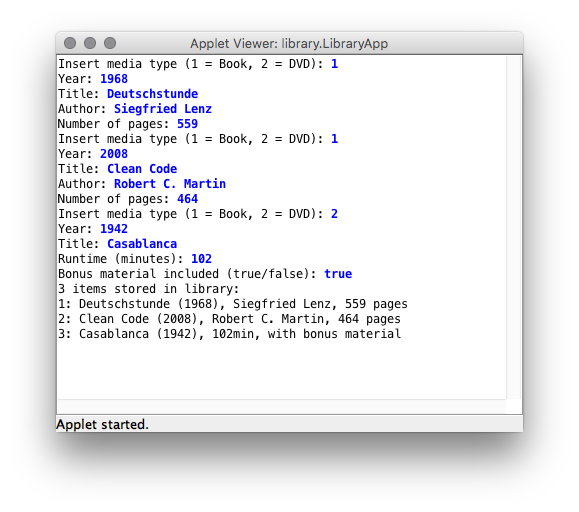

# U23 | Bibliotheks App

**Für dieses Übungsblatt gibt es kein Starterpaket**

Entwerfen Sie in dieser Aufgabe eine Klassenstruktur, die die Verwaltung
von Medien in einem Bibliothekskatalog abbildet. Der Katalog soll Bücher
und DVDs enthalten können; Ihre Anwendung nutzt die
implementierten Klassen um Medien durch den Benutzer einlesen zu
lassen.

| Eine beispielhafte Interaktion mit der fertigen BibliotheksApp |
|:------:|
|  |

Im ersten Teil der Anwendung werden die nötigen Klassen für die
Mediensammlung entworfen. Erstellen Sie hierzu in einem geeigneten Unterordner in Ihrem Projekt jeweils neue `.java`-Klassendateien:

-   Die Klasse `Media` stellt die Grundstruktur für alle anderen
    Medientypen dar. Eine Klassenvariable (`static`) speichert die
    Anzahl bereits erstellter `Media`-Instanzen und wird im Konstruktor
    entsprechend bei jedem Aufruf inkrementiert. In nicht-öffentlichen
    Instanzvariablen werden eine fortlaufende, numerische ID sowie das
    Erscheinungsjahr und der Titel des Mediums mit passenden Datentypen
    abgebildet. Initiale Werte für diese Eigenschaften werden dem
    Konstruktor übergeben.

    Die gespeicherten Werte können über `getter`-Methoden ausgelesen
    werden. Überschreiben Sie die implizit von `Object` geerbte Methode
    `toString`. Diese soll einen verketteten Text zurückgeben, der
    sowohl die ID als auch den Titel und das Erscheinungsjahr des
    jeweiligen Mediums zurück gibt.

-   Die Klasse `Book` erbt von `Media` und erweitert diese um jeweils
    eine Eigenschaft für den Autoren und die Anzahl der Seiten.
    Verwenden Sie geeignete Instanzvariablen und sorgen Sie dafür, dass
    deren Inhalt über `getter`-Methoden ausgelesen werden kann. Die
    initialen Werte sollen wieder über den Konstruktor übergeben werden.
    Achten Sie beim Implementieren des Konstruktors darauf, dass auch
    die ursprünglichen `Media`-Eigenschaften (Titel und Jahr) als
    Parameter übergeben werden, und dass der eigentliche Konstruktor der
    Superklasse mit diesen Werten aufgerufen wird. Überschreiben Sie
    die `toString`-Methode so, dass auch die zusätzlichen Eigenschaften
    im zurückgegebenen String enthalten sind.

-   Die Klasse `DVD` erbt ebenfalls von `Media`. Implementieren Sie
    diese genau wie `Book`. Anstatt Autorenname und Seitenzahl werden
    hier jedoch die zusätzlichen Eigenschaften Laufzeit (in Minuten) und die Information, ob Bonusmaterial auf der DVD vorhanden ist
    abgebildet.

Im zweiten Teil der Aufgabe wird eine `LibraryApp` erstellt. Erstellen Sie dazu eine neue Java-Klasse mit einer `main`-Methode. Das Programm soll dabei
folgende Aufgaben erfüllen:

-   In einem Array vom Typ `Media` werden drei Medien gespeichert.

-   Benutzende werden für jede Stelle des Arrays aufgefordert, die Daten
    eines neuen Medium einzugeben. Dabei können sie über eine numerische
    Eingabe auswählen, ob ein Buch oder eine DVD gespeichert werden
    soll.

-   Je nach Auswahl Benutzender werden anschließend die nötigen
    Informationen über die Konsole eingelesen. Mit den Eingaben wird ein
    entsprechende Objekt vom Typ `Book` oder `DVD` erstellt und im Array
    gespeichert.

-   Nach Eingabe aller Medien wird eine Liste mit dem Inhalt der
    Bibliothek ausgegeben. Iterieren Sie hierzu über das komplette Array
    und rufen Sie für jedes gespeicherte Objekt dessen
    `toString`-Methode auf. Die Rückgabe der Methode wird auf der
    Konsole ausgegeben.
- Verwenden Sie die Klasse [`java.util.Scanner`](https://docs.oracle.com/javase/7/docs/api/java/util/Scanner.html), um Eingaben von der Konsole auszulesen
